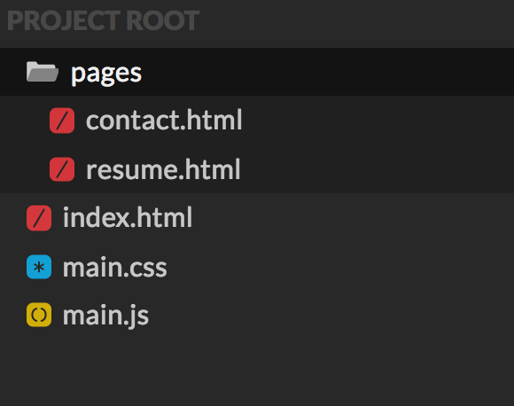

Personal Website
Codepen Instructions
Create a new CodePen project.

Instructions
You will create a codepen project for your personal website.

Your site will contain the following pages:
A main/home page (index.html) with a photo of you and a section where you describe yourself. You should also include your "interest" cards on this page.
A page with your professional work experiance (resume.html).
A contact me page (contact.html) which contains a form that the user can use to contact you.
There should also be a main stylesheet (main.css) that is used for styling your site.
All Javascript should be in a main javascript file (main.js)
Create a navigation bar that links to each of the pages correctly. The navigation bar should appear on each page. You can use your own styling or a Bootstrap nav bar.

